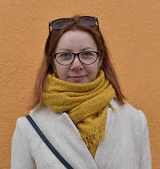

# Aksana Dziakanchuk

### Junior FrontEnd Developer

## Contact information

| :---        | :---                                                       |
| Discord     | Aksana Dziakanchuk (@adziakon)                             |
| E-mail      | a.dziakanchuk@gmail.com                                    |
| Telegram    | [@OksyPS](https://t.me/OksyPS)                                                    |
| Facebook    | [Aksana Dziakanchuk](https://www.facebook.com/aksana.peshka)                    |
| LinkedIn    | [Aksana Dziakanchuk](https://www.linkedin.com/in/aksana-dziakanchuk-54329386/) |

## About me
I am system analyst with 5 years of experience in banking sector.Graduated from Belarusian State University of Informatics and Radioelectronics with a Degree in software engineering. I am a punctual and motivated individual who is able to work in a busy environment, and produce high standarts of work.\
Now I want to change my work, and find new direction for myself. So I started to learn RS Schools Course.

## Skills
* HTML5, CSS3, JavaScript, PHP, OpenEdge ABL(Progress 4GL)
* SQL, MySQL, MS SQL, Progress 4GL
* SVN, GIT, GITHub, GITLab
* VS Code
* Docker, Kibana, Swagger
* SOAP, REST